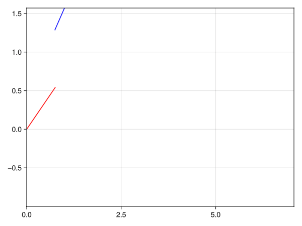

# Numerical algorithms implemented in Julia

## Algorithms
### Currently implemented:
- Fitting a straight line in 2 dimensions using the method of least squares 
- Fitting a plane in 3 dimensions using the method of least squares 
- Savitzky-Golay filter for 2 dimensional values
- Approximation of parametric curves using differential equation solvers 
  - Chase (Chase.jl): An object is constantly moving in the direction of another object with a constant speed value.
  - Pull (Pull.jl): An object is being pulled or pushed by another moving object through a solid, inflexible beam with $d$ length that is attached to the pulled/pushed object in question.
- Bézier-curves:
  - Custom generation with optional noise
  - Visualization
  - Degree elevation
  - Curve splitting
- Bezier-surfaces
  - Custom generation with optional noise
  - Visualization

### TODO:
- Prey-Predator model
- Perpendicular and parallel plane/line fitting
- Implement Bezier-splines, and interactive Bezier-spline manipulation
- Implement NURBS
### Gallery

#### Chase.jl: "Dog chasing runner"

#### Bézier-curves

##### Bézier-curve in 2D space

##### Bézier-curve in 3D space

##### Parametric surface defined through Bézier-curves
